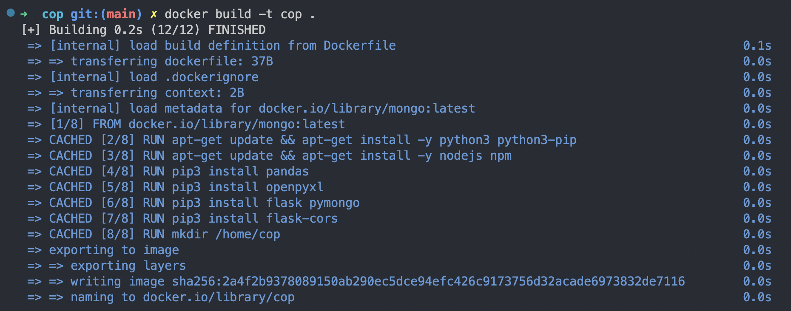
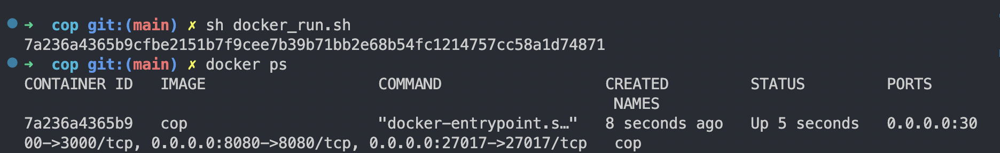
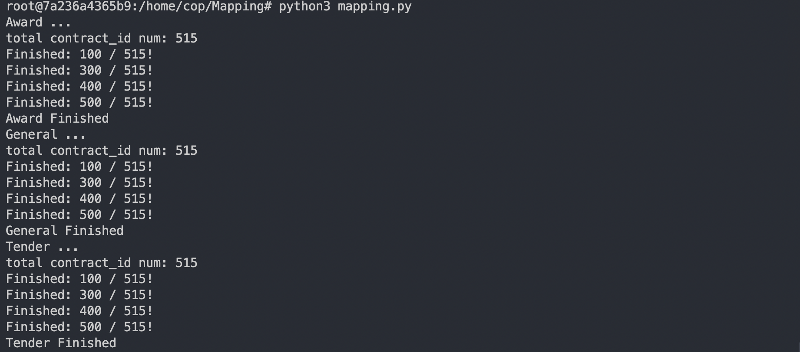
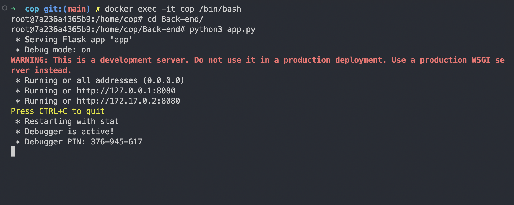
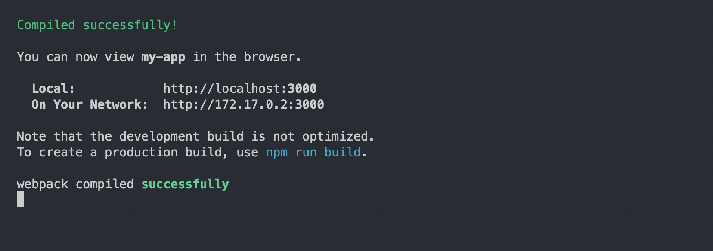
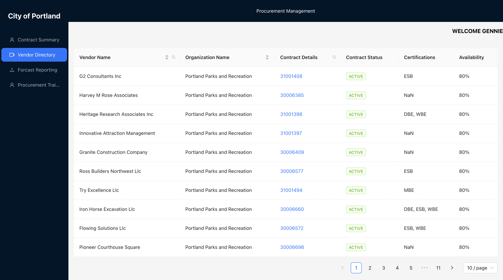

## City of Portland: Designing an Open Contracting Program
This document provides the steps for deploying and running the City of Portland: Designing an Open Contracting Program using Docker. This program involves converting contract data into the Open Contracting Data Standard (OCDS) and presenting it through a front-end and back-end application.
### **1. Build Docker Image**
First, build the Docker image containing the necessary dependencies:
```
docker build -t cop .
```


### **2. Start Docker Container**
Start the Docker container using the following command:
```
sh docker_run.sh
```
To verify if the container has started successfully:
```
docker ps
```


### **3. Set up Mongodb Database**
Execute the following steps to initialize the database and run the mapper, which converts contract data into the OCDS standard and stores it in the MongoDB database inside the Docker container:
```
docker exec -it cop /bin/bash
cd Mapping/
python3 mapping.py
```

### **4. Start back-end server**
Start the back-end server inside the container:
```
docker exec -it cop /bin/bash
cd Back-end/
python3 app.py
```

### **4. Start Front-end**
Finally, set up and start the front-end application:
```
docker exec -it cop /bin/bash
cd Front-end/
npm install
npm start
```

Access the dashboard at the following URL:http://localhost:3000

### **Notes**
- Ensure that Docker is installed and configured on your machine before running any Docker commands.
- Follow the steps in order to ensure all services are correctly configured and started.
